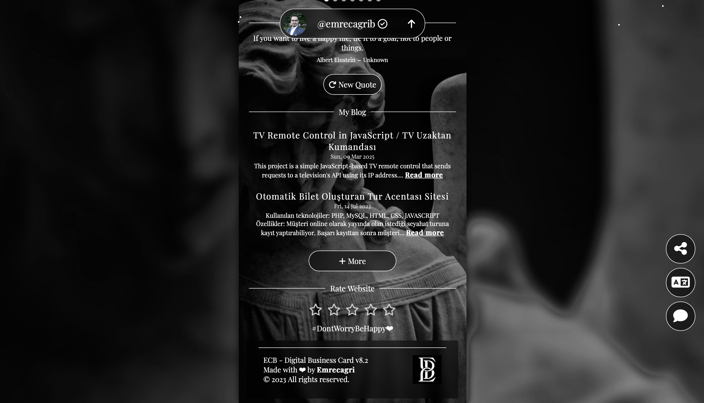

# Çok Dilli Takip ve Yönlendirme Destekli Link Sayfası / Multilingual Link Page with Tracking and Redirect System
----------------

Demo: [https://link.emrecb.com](https://link.emrecb.com/)

**Link Sayfası**, tamamen kendi geliştirdiğim, çerçeve ya da hazır şablon kullanmadan oluşturduğum, çok dilli ve izleme odaklı bir bağlantı yönlendirme projesidir. Tüm tasarım, **HTML**, **CSS** ve **JavaScript** ile sıfırdan yazılmıştır.

### Öne Çıkan Özellikler

*   **Çok Dilli Destek**  
    Ziyaretçinin cihaz veya tarayıcı dilini otomatik algılar ve sayfayı o dile göre gösterir.
*   **Benzersiz Ziyaretçi Takibi**  
    Her giriş yapan kullanıcıya özel bir token oluşturulur. Bu token:
    *   Sayfadaki tüm bağlantılara eklenir
    *   Paylaşılan bağlantıların takibini sağlar
    *   Oturum bazlı analiz yapılmasına imkân tanır
*   **Yönlendirme ve Loglama Sistemi**  
    Sayfadaki bağlantılar doğrudan dış sayfalara gitmez; önce özel bir PHP yönlendirme sayfasına uğrar:
    *   Bu yapı sayesinde bağlantı trafiği detaylı şekilde analiz edilebilir
    *   Herhangi bir bağlantı anlık olarak devre dışı bırakılabilir veya değiştirilebilir
*   **Anlık Kayıt ve Bildirim Sistemi**  
    Tüm sayfa girişleri ve bağlantı tıklamaları **anlık** olarak veritabanına kaydedilir. Aynı zamanda, her bir hareket internet tabanlı bir mesajlaşma uygulaması üzerinden (örneğin Telegram, Slack) **anlık mesaj** olarak gönderilir:
    *   Kullanıcı davranışlarını canlı olarak izleyebilirsiniz
    *   Paylaşılan ya da tıklanan bağlantılardan anında haberdar olursunuz
*   **Özgün Tasarım**  
    Sayfa tasarımı, animasyonlar ve tüm işlevsellik el ile kodlanmıştır. Hafif, hızlı ve kullanıcı dostu bir deneyim sunar.

### Kullanım Alanları

*   Biyografi bağlantı sayfaları (link in bio)
*   Kampanya ya da promosyon takibi
*   Tüm dış bağlantıların merkezi kontrolü ve izlenmesi

### Kullanılan Teknolojiler

*   HTML5
*   CSS3
*   JavaScript (Vanilla)
*   PHP (Yönlendirme ve loglama sistemi için)
*   MySQL (Veri kaydı için)
*   Mesajlaşma API’si (Örn. Telegram Bot API)  

----------------

# Multilingual Link Page with Tracking and Redirect System
----------------

**Link Page** is a customizable, multilingual landing page project that I built entirely from scratch using **HTML**, **CSS**, and **JavaScript**, without relying on any frameworks or templates.

### Key Features

*   **Multilingual Support**  
    Automatically detects the visitor’s device/browser language and loads the page in the appropriate language.
*   **Unique Visitor Tracking**  
    Each visitor is assigned a unique token during their session. This token is appended to all outbound links, enabling:
    *   Individual click tracking
    *   Session-based analytics
    *   Share tracing (even if a link is shared externally)
*   **Redirect System with Logging**  
    Instead of linking directly to external pages, all links first pass through a custom PHP-based redirect handler:
    *   Allows real-time tracking and analytics
    *   Enables link deactivation or modification without needing to change the original page
*   **Real-Time Logging & Notifications**  
    All page visits and link clicks are recorded **instantly** in a database. Additionally, each activity is sent in real time as a message via an internet-based messaging application (e.g., Telegram, Slack), allowing you to:
    *   Monitor user behavior live
    *   Stay notified of shared or accessed links the moment they happen
*   **Custom Design**  
    The entire layout, styling, and interactivity were created manually to ensure a lightweight, fast, and original experience.

### Use Cases

*   Personal or business link-in-bio pages
*   Campaign or promotion tracking
*   Centralized hub for managing and monitoring multiple external links

### Technologies Used

Messaging API (e.g., Telegram Bot API)

HTML5

CSS3

Vanilla JavaScript

PHP (for redirect and logging system)

MySQL (for data storage)
